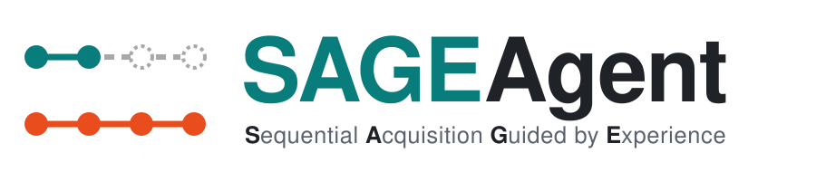
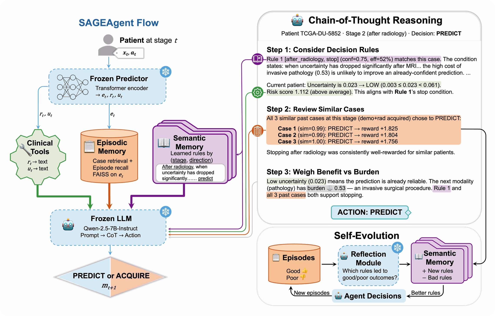
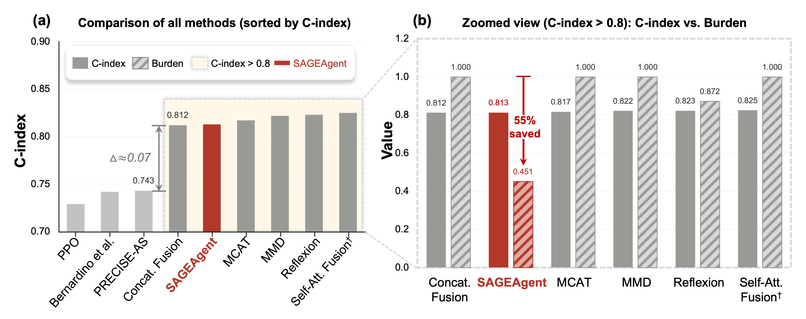

<div align="center">
  <picture>
    <source media="(prefers-color-scheme: dark)" srcset="assets/banner_dark.svg">
    
  </picture>
</div>

<h3 align="center">
  <a href="https://arxiv.org/abs/2607.09521"><b>Paper</b></a> |
  <a href="docs/GETTING_STARTED.md"><b>Getting Started</b></a> |
  <a href="docs/CODE_STRUCTURE.md"><b>Code Structure</b></a> |
  <a href="#results"><b>Results</b></a> |
  <a href="#citation"><b>Citation</b></a>
</h3>

<div align="center">
  <a href="https://arxiv.org/abs/2607.09521"></a>
  
  
  
  <a href="https://huggingface.co/Qwen/Qwen2.5-7B-Instruct"></a>
  <a href="LICENSE"></a>
  <a href="https://github.com/Chongyu1117/SAGEAgent/stargazers"></a>
</div>

<br>

**SAGEAgent** (**S**equential **A**cquisition **G**uided by **E**xperience) is a training-free, self-evolving LLM agent that decides, patient by patient and step by step along the clinical workup, whether the next diagnostic modality is worth acquiring for multimodal survival prediction. This repository contains the official implementation of our **MICCAI 2026** paper.

## News

- **[2026-09]** 📦 Pre-extracted [embeddings](embedding) of the glioma cohort and the [rules learned in the paper](rules/glioma.json) are released.
- **[2026-07]** 📄 Paper available on [arXiv](https://arxiv.org/abs/2607.09521).
- **[2026-06]** 🎉 SAGEAgent is accepted to **MICCAI 2026**!
- **[2026-03]** 🚀 Code released.

## Overview

<p align="center">
  
</p>

> **Does every cancer patient truly need a complete diagnostic workup for accurate survival prediction?**

Diagnostic modalities in oncology follow a clinically mandated order of escalating burden: **demographics → radiology → pathology → genomics**. Static multimodal fusion gives every patient the same full workup, RL acquisition policies make black-box decisions, and LLM-based agents treat tests as independent and unordered. SAGEAgent instead treats acquisition as a sequential decision along the clinical order. At every stage it either **acquires** the next modality or **stops and predicts**, and it explains each decision with a chain of thought grounded in clinical tools, similar past cases, and rules it has learned from its own experience.

On a glioma cohort combining TCGA-LGG, TCGA-GBM and BraTS with four modalities, SAGEAgent **cuts the average acquisition burden by 55%** (0.451 vs. 1.000 for a full workup). Its C-index of 0.813 is not significantly different from the full-workup fusion baselines (0.812–0.825, p ≥ 0.30). It learns to skip invasive pathology for half of the cohort.

**SAGEAgent: A Self-Evolving Agent for Cost-Aware Modality Acquisition in Multimodal Survival Prediction**<br>
Chongyu Qu, Can Cui, Zhengyi Lu, Junchao Zhu, Tianyuan Yao, Junlin Guo, Juming Xiong, Yanfan Zhu, Yuechen Yang, Bennett A. Landman, and Yuankai Huo<br>
*Vanderbilt University · Vanderbilt University Medical Center*<br>
*MICCAI 2026*

## Method

<p align="center">
  
</p>

At each stage, a **frozen multimodal Transformer survival predictor** encodes the modalities acquired so far into an embedding $e_t$ and a Cox risk score $r_t$. A lightweight **calibrated uncertainty head** estimates $u_t$, the probability that the prediction would change if the remaining modalities were acquired. Three signal sources then feed a **frozen LLM** (Qwen2.5-7B-Instruct by default):

- 🛠️ **Clinical tools** translate $u_t$ and $r_t$ into natural language, e.g. *"uncertainty is LOW"* or *"above-average risk"*.
- 🗂️ **Episodic memory** retrieves similar training patients with their outcomes (FAISS), together with the agent's own past episodes at the same stage, re-ranked by similarity plus reward.
- 📖 **Semantic memory** stores interpretable rules indexed by stage and direction (stop / acquire). Periodic self-reflection proposes new rules, tracks how effective each one is, and deprecates rules that keep leading to poor outcomes.

The LLM reasons step by step and outputs `ACQUIRE` or `PREDICT`. All adaptation happens in memory; **no gradient updates are made to the LLM**. The rules learned in our experiments are released in [`rules/glioma.json`](rules/glioma.json).

## Results

<p align="center">
  
</p>

<table>
  <thead>
    <tr>
      <th align="left">Category</th>
      <th align="left">Method</th>
      <th align="center">C-index ↑</th>
      <th align="center">Burden ↓</th>
      <th align="center">D</th>
      <th align="center">R</th>
      <th align="center">P</th>
      <th align="center">G</th>
    </tr>
  </thead>
  <tbody>
    <tr><td rowspan="4">Static fusion</td><td>Concat. Fusion</td><td align="center">0.812 <sub>[.77, .86]</sub></td><td align="center">1.000 <sub>[1.00, 1.00]</sub></td><td align="center">170</td><td align="center">170</td><td align="center">170</td><td align="center">170</td></tr>
    <tr><td>MCAT</td><td align="center">0.817 <sub>[.78, .86]</sub></td><td align="center">1.000 <sub>[1.00, 1.00]</sub></td><td align="center">170</td><td align="center">170</td><td align="center">170</td><td align="center">170</td></tr>
    <tr><td>MMD</td><td align="center">0.822 <sub>[.78, .86]</sub></td><td align="center">1.000 <sub>[1.00, 1.00]</sub></td><td align="center">170</td><td align="center">170</td><td align="center">170</td><td align="center">170</td></tr>
    <tr><td>Self-Att. Fusion<sup>†</sup></td><td align="center">0.825 <sub>[.78, .87]</sub></td><td align="center">1.000 <sub>[1.00, 1.00]</sub></td><td align="center">170</td><td align="center">170</td><td align="center">170</td><td align="center">170</td></tr>
    <tr><td rowspan="3">RL-based acquisition</td><td>Bernardino et al.</td><td align="center">0.742 <sub>[.69, .79]</sub></td><td align="center">0.125 <sub>[.10, .15]</sub></td><td align="center">170</td><td align="center">60</td><td align="center">14</td><td align="center">2</td></tr>
    <tr><td>PRECISE-AS</td><td align="center">0.743 <sub>[.69, .79]</sub></td><td align="center">0.127 <sub>[.10, .16]</sub></td><td align="center">170</td><td align="center">61</td><td align="center">14</td><td align="center">2</td></tr>
    <tr><td>PPO</td><td align="center">0.729 <sub>[.68, .78]</sub></td><td align="center">0.124 <sub>[.10, .16]</sub></td><td align="center">170</td><td align="center">49</td><td align="center">14</td><td align="center">5</td></tr>
    <tr><td rowspan="2">LLM-based acquisition</td><td>Reflexion</td><td align="center">0.823 <sub>[.78, .87]</sub></td><td align="center">0.872 <sub>[.84, .90]</sub></td><td align="center">170</td><td align="center">169</td><td align="center">165</td><td align="center">107</td></tr>
    <tr><td><b>SAGEAgent (ours)</b></td><td align="center">0.813 <sub>[.77, .86]</sub></td><td align="center"><b>0.451</b> <sub>[.41, .50]</sub></td><td align="center">170</td><td align="center">166</td><td align="center"><b>85</b></td><td align="center"><b>11</b></td></tr>
  </tbody>
</table>

<sub>Results as reported in the paper. Glioma cohort, 170 complete-modality patients, nested 5×5 cross-validation. Values are the mean over the 5 outer folds with 95% bootstrap confidence intervals (1,000 stratified resamples). Burden per modality: demographics 0.03, radiology 0.14, pathology 0.53, genomics 0.30 (full workup = 1.00). **D / R / P / G** = number of the 170 patients for whom demographics / radiology / pathology / genomics was acquired. <sup>†</sup> The predictor backbone used by SAGEAgent.</sub>

<details>
<summary><b>Component ablation</b> (each row adds one component to the base LLM)</summary>
<br>

| Configuration | C-index ↑ | Burden ↓ | HV ↑ | D | R | P | G |
|:--|:-:|:-:|:-:|:-:|:-:|:-:|:-:|
| Base LLM | 0.827 <sub>[.79, .87]</sub> | 0.798 <sub>[.77, .82]</sub> | 0.066 <sub>[.06, .08]</sub> | 170 | 170 | 168 | 59 |
| + Tools | 0.830 <sub>[.79, .87]</sub> | 0.843 <sub>[.82, .87]</sub> | 0.052 <sub>[.04, .06]</sub> | 170 | 170 | 165 | 90 |
| + Tools + Episodic | 0.814 <sub>[.77, .86]</sub> | 0.611 <sub>[.56, .66]</sub> | 0.122 <sub>[.10, .14]</sub> | 170 | 170 | 117 | 43 |
| + Tools + Semantic | 0.819 <sub>[.78, .86]</sub> | 0.706 <sub>[.66, .75]</sub> | 0.094 <sub>[.08, .11]</sub> | 170 | 170 | 139 | 58 |
| **SAGEAgent** | 0.813 <sub>[.77, .86]</sub> | **0.451** <sub>[.41, .50]</sub> | **0.172** <sub>[.15, .20]</sub> | 170 | 166 | 85 | 11 |

<sub>All configurations use frozen Qwen2.5-7B-Instruct with majority-vote aggregation. HV = (C-index − 0.5) × (1 − burden).</sub>

</details>


## Getting Started

- 📦 [Installation](docs/GETTING_STARTED.md#installation)
- 🗂️ [Data](docs/GETTING_STARTED.md#data) (included) and [using your own dataset](docs/GETTING_STARTED.md#your-own-dataset)
- 🚀 [Training and evaluation pipeline](docs/GETTING_STARTED.md#pipeline)
- 📜 [Evaluating with the released rules](docs/GETTING_STARTED.md#released-rules)
- 🧪 [Ablations](docs/GETTING_STARTED.md#ablations)
- ⚙️ [Configuration](docs/GETTING_STARTED.md#configuration)
- 🧱 [Code structure](docs/CODE_STRUCTURE.md)

## Citation

If you find SAGEAgent useful for your research, please cite:

```bibtex
@inproceedings{qu2026sageagent,
  title     = {SAGEAgent: A Self-Evolving Agent for Cost-Aware Modality Acquisition in Multimodal Survival Prediction},
  author    = {Qu, Chongyu and Cui, Can and Lu, Zhengyi and Zhu, Junchao and Yao, Tianyuan and Guo, Junlin and Xiong, Juming and Zhu, Yanfan and Yang, Yuechen and Landman, Bennett A. and Huo, Yuankai},
  booktitle = {Medical Image Computing and Computer Assisted Intervention (MICCAI)},
  year      = {2026}
}
```

## License

This project is released under the [Apache 2.0 license](LICENSE).

## Acknowledgments

This research was supported by the National Institutes of Health (NIH) through grants F30CA275020, R01CA253923 (Landman & Maldonado), R01CA275015 (Maldonado & Lenburg), U01CA152662 (Grogan), U01CA196405 (Maldonado), and P30CA068485-29S1, as well as the National Science Foundation (NSF) through CAREER 1452485 and grant 2040462. Additional support was provided by the Vanderbilt Institute for Surgery and Engineering through T32EB021937-07, the Vanderbilt Institute for Clinical and Translational Research via UL1TR002243-06, the Pierre Massion Directorship in Pulmonary Medicine, and the American College of Radiology Fund for Collaborative Research in Imaging (FCRI) Grant.

We use data from [TCGA-LGG](https://www.cancerimagingarchive.net/collection/tcga-lgg/), [TCGA-GBM](https://www.cancerimagingarchive.net/collection/tcga-gbm/) and [BraTS](https://www.med.upenn.edu/cbica/brats/), and build on [Qwen2.5](https://github.com/QwenLM/Qwen2.5) and [FAISS](https://github.com/facebookresearch/faiss).
