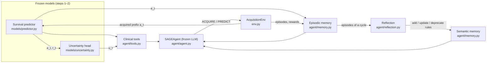

# Code Structure

[← Back to README](../README.md) · [Getting started](GETTING_STARTED.md)

```
SAGEAgent/
├── configs/glioma.yaml          # every setting of an experiment (data, pathway, models, agent, evaluation)
├── embedding/glioma/
│   ├── cohort.npz               # pre-extracted 32-d features and survival of the 962 patients
│   └── splits.json              # nested 5×5 cross-validation splits of the paper
├── rules/glioma.json            # rules learned in the paper, one rule set per pipeline (evaluate.py --rules)
├── prompts/
│   ├── decision.txt             # per-stage decision prompt (filled from the config and the tools)
│   └── reflection.txt           # reflection prompt (rule discovery)
├── sageagent/
│   ├── config.py                # YAML loading, --set overrides, path resolution
│   ├── clinical.py              # ClinicalPathway: modality order, burdens, stages, actions
│   ├── data.py                  # Cohort file, nested cross-validation splits
│   ├── env.py                   # AcquisitionEnv: states, valid actions, stage/terminal rewards
│   ├── metrics.py               # C-index, HV, AUROC/ECE, stratified and paired bootstrap
│   ├── pipeline.py              # output layout, loading a pipeline's models, assembling the agent
│   ├── utils.py                 # seeding, devices, logging, JSON
│   ├── models/
│   │   ├── encoder.py           # multimodal Transformer encoder with mask tokens
│   │   ├── predictor.py         # survival predictor (Cox head) and its losses
│   │   └── uncertainty.py       # calibrated uncertainty head, prefix training data, temperature scaling
│   └── agent/
│       ├── llm.py               # frozen chat LLM (Hugging Face transformers)
│       ├── tools.py             # uncertainty tool, survival predictor tool, case retrieval (FAISS)
│       ├── memory.py            # episodic memory, semantic memory, rule files
│       ├── reflection.py        # self-reflection: label episodes, credit rules, propose new rules
│       ├── agent.py             # SAGEAgent: prompt assembly and action parsing; threshold baseline
│       └── runner.py            # training episodes, experience accumulation, batched test episodes
├── scripts/
│   ├── prepare_glioma.py        # MMD feature pickle → cohort file
│   ├── make_splits.py           # nested cross-validation splits
│   ├── export_rules.py          # learned rules of an agent run → rule file
│   └── compare_runs.py          # paired bootstrap between two evaluation runs
├── tests/test_sageagent.py      # end-to-end checks on synthetic data with a scripted LLM (CPU)
├── train_predictor.py           # step 1
├── train_uncertainty.py         # step 2
├── run_agent.py                 # step 3: experience accumulation
└── evaluate.py                  # step 4: majority-vote evaluation
```

## How the pieces fit together



## Main components

**Clinical pathway** (`clinical.py`). The modalities in their mandated order, each with a burden b(m). Since the order is fixed, the acquired modalities always form a prefix. A state is therefore described by its depth t, and each decision is binary: acquire m<sub>t+1</sub> (`ACQUIRE_<NAME>`) or stop (`PREDICT`). Stage names such as `after_radiology` index the learned rules.

**Predictor and uncertainty head** (`models/`). The predictor projects each modality with its own MLP, replaces missing modalities with learnable mask tokens, and mixes the tokens with a 2-layer Transformer (d = 128, 4 heads). A Cox head then gives the risk r<sub>t</sub>, and the fused embedding is e<sub>t</sub>. The uncertainty head is an MLP on [e<sub>t</sub>, a<sub>t</sub>]. It is trained to predict whether |r<sub>t</sub> − r<sub>full</sub>| > τ, and temperature scaling calibrates its output u<sub>t</sub>.

**Environment** (`env.py`). The environment is stateless: `step(state, action)` returns the next state and the reward. Acquiring m<sub>t+1</sub> gives R<sub>stage</sub> = −b(m<sub>t+1</sub>) + α·max(0, u<sub>t</sub> − u<sub>t+1</sub>). Stopping at t gives R<sub>term</sub> = (1 − u<sub>t</sub>) − λ·B<sub>t</sub>.

**Clinical tools** (`agent/tools.py`). The uncertainty tool reports u<sub>t</sub> with a level (very low … very high) from quintiles of the training distribution. The survival predictor tool reports r<sub>t</sub> relative to training patients at the same stage (below / around / above average). Case retrieval returns the k most similar training patients with their outcomes. All three are calibrated separately for each pipeline, on its training patients only.

**Episodic memory** (`agent/memory.py`). Stores every decision (embedding, stage, action, rewards). Recall is stage-matched and ranks past decisions by cosine similarity plus the min–max normalized episode reward.

**Semantic memory and reflection** (`agent/memory.py`, `agent/reflection.py`). Rules are indexed by (stage, direction), and the agent's adherence to the relevant rules is recorded at every decision. At each reflection cycle:

1. The cycle's episodes are ranked by total reward, and the top and bottom quartiles are labelled good and poor.
2. Each rule's effectiveness is updated as the share of rule-following episodes that were good. Rules that are mostly followed by poor episodes are deprecated.
3. The LLM proposes new rules. A proposal is accepted only if it names a valid stage and a clear direction and is not a near-duplicate of an existing rule.

At most 10 rules are active. Rules are plain text in the prompt, so they can be shared between runs and models: `scripts/export_rules.py` writes the rules of a run to a rule file, and `evaluate.py --rules` reads one. The rules of the paper are released this way in `rules/glioma.json`.

**Agent** (`agent/agent.py`). Builds the prompt from the three signal sources, lets the LLM reason step by step, and parses the `ACTION:` line. If no action can be parsed, it continues the workup. `UncertaintyThresholdPolicy` is the naive baseline that stops once u<sub>t</sub> < τ.

## Outputs

```
outputs/<experiment>/
├── predictors/outer_k/inner_m/          # predictor.pt, uncertainty_head.pt, predictor_history.json
├── predictors/summary.json              # validation / test C-index of every predictor
├── agent/<run>/outer_k/inner_m/
│   ├── episodic.json                    # stored decisions and episodes
│   ├── semantic.json                    # learned rules with their outcome statistics
│   ├── reflections.json                 # every reflection cycle (prompt answer, accepted / rejected rules)
│   ├── episodes.jsonl                   # every training episode with the agent's reasoning
│   └── tool_calibration.json            # uncertainty and risk thresholds of this pipeline
└── eval/<name>/
    ├── summary.json                     # C-index, burden, HV, 95% intervals, acquisition counts
    ├── patients.csv                     # per-patient voted decisions, risk and burden
    └── traces/outer_k/inner_m.json      # prompts and chain of thought of every test decision
```
